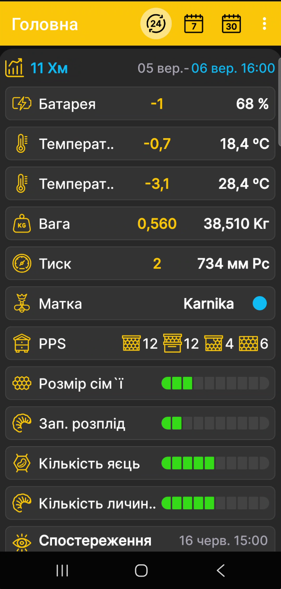

# Як завантажити архів

Перед початком переконайтеся, що застосунок BeeApiary оновлено через Google Play, а прошивку пасічних ваг випущено в серпні 2024 року або пізніше. Якщо встановлена версія старіша або ви не впевнені в її даті, скористайтеся інструкцією [Оновити прошивку пасічних ваг BeeApiary](update-device.md).

Ручне завантаження архіву корисне, якщо у вагах немає SIM-картки, інші способи синхронізації тимчасово недоступні або у вимірюваннях з'явилися прогалини. Застосунок імпортує збережені дані й доповнює ними локальну історію.

!!! warning "microSD і заряд батареї"
    Для завантаження архіву у вагах має бути встановлена справна картка microSD із доступними даними. Пряме Wi-Fi-з'єднання утримує ваги в активному стані та збільшує споживання енергії, тому без потреби не виконуйте цю процедуру частіше одного разу на добу.

1. [Активуйте або перезапустіть пасічні ваги BeeApiary](../device/installation.md#activation-reset) магнітним ключем.
2. Протягом доступного інтервалу, зазвичай близько однієї хвилини, підключіть телефон до `apiary_net` і залишайтеся поруч із вагами.
3. Відкрийте застосунок BeeApiary.
4. Дочекайтеся, поки застосунок автоматично знайде ваги поруч.
5. У запиті **«Пристрій поруч. Завантажити архів?»** натисніть **Так**.

    { .doc-screenshot }

6. Дочекайтеся завершення імпорту й одразу від'єднайте телефон від `apiary_net`. Після від'єднання пасічні ваги зможуть перейти в режим сну й не витрачатимуть зайвий заряд батареї.
7. Перегляньте завантажені дані стандартними засобами застосунку.

    { .doc-screenshot }

Після підтвердження застосунок автоматично завантажує архів і зберігає локальну копію вимірювань. Якщо інші канали пропустили частину даних, архів може заповнити відповідні прогалини в історії. Формат і тривалість зберігання описано на сторінці [Зберігання даних](../system/data-storage.md).
