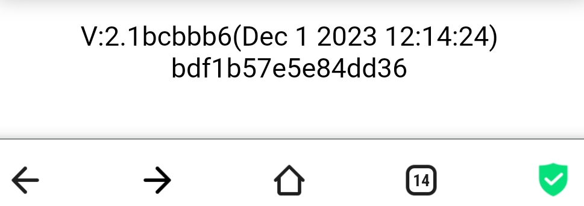

# Як оновити прошивку вимірювального пристрою BeeApiary

1. Дочекайтеся, поки пристрій засне, і вийміть microSD.
2. У корені картки створіть каталог `/fm`, якщо його немає.
3. Помістіть файл оновлення `Apiary.bin` до `/fm`.
4. Поверніть microSD у пристрій.
5. [Активуйте або перезапустіть пристрій](../device/installation.md#activation-reset) магнітним ключем.
6. Дочекайтеся звичайного SMS із вимірюваннями; оновлення зазвичай триває до двох хвилин.
7. Перевірте версію й дату прошивки внизу головної сторінки вебінтерфейсу.

{ .doc-screenshot }

Файли прошивки: [Hive_Controller](https://github.com/Ivan-Bdgilko/Hive_Controller).

!!! warning
    Переконайтеся, що `Apiary.bin` призначений саме для вашої версії пристрою. Сервісні способи оновлення через FTP або сервер не входять до цієї процедури.
