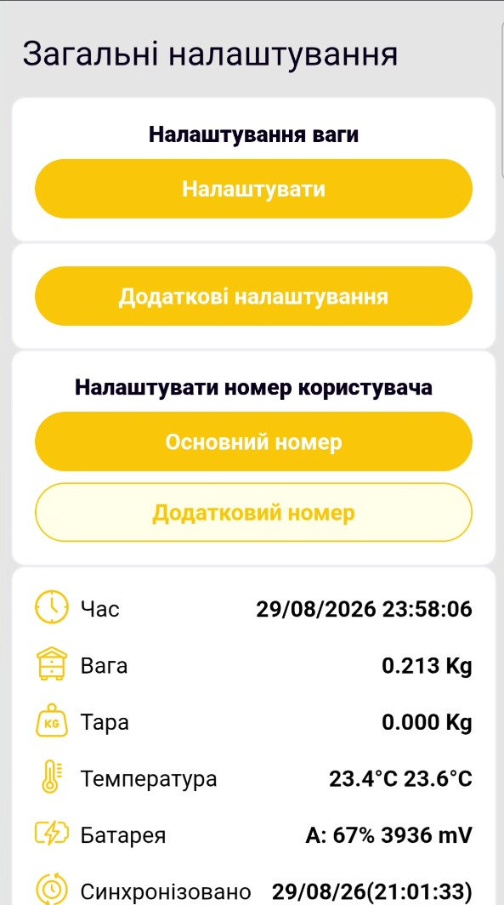
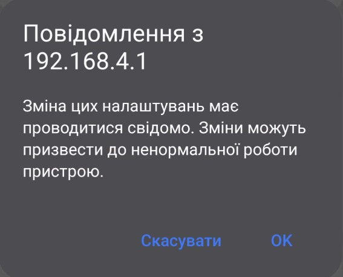

# Як перевірити налаштування синхронізації через Wi-Fi

Ця локальна перевірка необов'язкова. Виконайте її, якщо потрібно переконатися, що налаштування синхронізації та Wi-Fi мережі записані у пристрій.

Перевірка показує збережені параметри, але не підтверджує доступ пристрою до Інтернету або фактичне надходження даних до застосунку.

!!! warning "Не змінюйте параметри без потреби"
    Додаткові налаштування впливають на роботу пристрою. Не змінюйте перемикачі, мережеві параметри або ключі, якщо не розумієте їхнього призначення. Для цієї перевірки достатньо лише переглянути значення.

1. [Підключіть телефон до точки доступу пристрою](configure-local-wifi.md) і відкрийте `http://192.168.4.1`.
2. На головній сторінці вебінтерфейсу пристрою виберіть **Додаткові налаштування**.

    { .doc-screenshot }

3. Вебінтерфейс попередить, що необдумані зміни можуть порушити нормальну роботу пристрою. Для переходу до перегляду натисніть **OK**.

    { .doc-screenshot }

4. Переконайтеся, що прапорець **WiFi синхронізація** встановлений.
5. Перевірте мережеві параметри:

    - **Мережа WiFi** містить назву потрібної Wi-Fi мережі пасіки;
    - **Пароль WiFi** заданий і відображається замаскованим;
    - **Ключ STA** заданий і відображається замаскованим.

    { .doc-screenshot }

    Призначення всіх перемикачів і полів пояснено на сторінці [Додаткові налаштування пристрою](../system/additional-settings.md).

6. Не змінюючи інших параметрів, натисніть **На головну** та від'єднайтеся від `apiary_net`.

Якщо синхронізацію вимкнено, назва мережі неправильна або пароль чи ключ відсутні, повторіть [налаштування синхронізації через Wi-Fi мережу пасіки](configure-wifi-sync.md) у застосунку та ще раз передайте налаштування пристрою.

Готово: ви перевірили, що потрібні параметри збережені у пристрої. Остаточним підтвердженням роботи каналу є надходження нового набору даних до застосунку після запланованого циклу.
