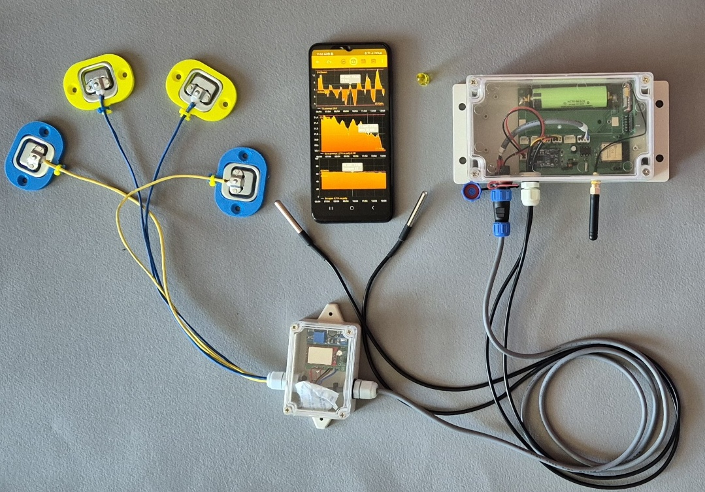

# BeeApiary

BeeApiary — система контролю пасіки, що складається з автономного вимірювального пристрою та застосунку Android. Пристрій збирає показники вулика та зберігає їх на microSD.

## Дані залишаються під вашим контролем

- Усі дані зберігаються локально. Немає обов'язкової прив'язки до зовнішніх серверів — SIM-карта не потрібна.
- Дані доступні через локальну мережу Wi-Fi безпосередньо на пасіці — SIM-карта не потрібна.
- Віддалений доступ через Інтернет можливий через локальну мережу Wi-Fi на пасіці — окрема SIM-карта для кожного пристрою не потрібна.
- Дані можна отримувати безпосередньо через Bluetooth, коли ви перебуваєте поруч із пристроєм. Синхронізація відбувається автоматично — SIM-карта не потрібна.
- Доступ через мобільного оператора також залишається доступним і не потребує мобільного Інтернету. Для цього достатньо SIM-карти з мінімальним тарифом.

## З чого почати

- [Запустити тільки застосунок](quick-start/app-only.md)
- [Налаштувати пристрій із GSM](quick-start/gsm.md)
- [Підключитися до локальної мережі Wi-Fi](quick-start/local-wifi.md)
- [Налаштувати повну систему](quick-start/full-system.md)

## Документація за потребою

- [Використання застосунку BeeApiary](app/overview.md)
- [Встановлення вимірювального пристрою BeeApiary](device/installation.md)
- [Передача та зберігання даних](system/overview.md)
- [Практичні інструкції](guides/index.md)
- [Усунення проблем](troubleshooting/index.md)

{ .doc-photo }
