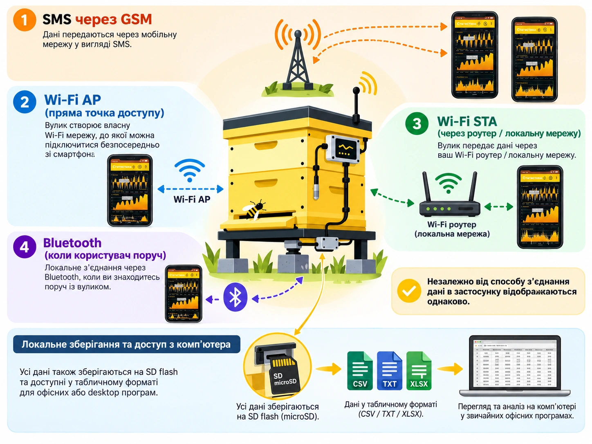

# { .home-brand-logo } BeeApiary — пасічні ваги та моніторинг пасіки { #beeapiary }

BeeApiary — пасічні ваги та система моніторингу пасіки з підтримкою GSM, Wi-Fi і Bluetooth. Ваги для вулика разом із датчиками та застосунком допомагають стежити за станом вуликів, досліджувати зміни й вести журнал як безпосередньо на пасіці, так і віддалено. Застосунок також можна використовувати окремо, без ваг.

!!! note "Моделі ваг"
    - [Пасічні ваги GSM Wi-Fi Bluetooth](https://www.olx.ua/d/obyavlenie/vagi-paschn-apiary-scales-vesy-pasechnye-vesy-gsm-wi-fi-dlya-paseki-IDUTO1F.html)
    - [Пасічні ваги GSM Wi-Fi Bluetooth з плюсіком](https://www.olx.ua/d/obyavlenie/vesy-pasechnye-vesy-gsm-wi-fi-dlya-paseki-IDZ7kfw.html "Плюсік — опорна хрестовина")

!!! note "Додаткові відеоматеріали"
    - [Відео на YouTube-каналі BeeApiary](https://www.youtube.com/@beeApiary)

Один комплект може працювати автономно як пасічні ваги BeeApiary, а разом із датчиками та застосунком утворює розумний вулик BeeApiary. Кілька таких вуликів, об'єднаних у застосунку з цифровим журналом, — це розумна пасіка BeeApiary. Різні способи доступу до даних, довготривалі нотатки, вимірювання та події створюють цілісну картину життя пасіки й допомагають бджоляру краще розуміти своїх бджіл.

## Дані залишаються під вашим контролем

- Усі дані зберігаються локально. Немає обов'язкової прив'язки до зовнішніх серверів — SIM-карта не потрібна. ([Завантаження архіву вимірювань](guides/download-archive.md))
- Дані доступні через локальну мережу Wi-Fi безпосередньо на пасіці — SIM-карта не потрібна. ([Підключення до точки доступу ваг](guides/configure-local-wifi.md))
- Віддалений доступ через Інтернет можливий через локальну мережу Wi-Fi на пасіці — окрема SIM-карта для кожного пристрою не потрібна. ([Налаштування передавання через Wi-Fi мережу пасіки](guides/configure-wifi-sync.md))
- Дані можна отримувати безпосередньо через Bluetooth, коли ви перебуваєте поруч із пристроєм. Синхронізація відбувається автоматично — SIM-карта не потрібна. ([Налаштування Bluetooth-синхронізації](guides/configure-bluetooth-sync.md))
- Доступ через мобільного оператора також залишається доступним і не потребує мобільного Інтернету. Для цього достатньо SIM-карти з мінімальним тарифом. ([Налаштування GSM і SMS](guides/configure-gsm.md))

[Порівняти способи отримання даних у застосунку](system/connectivity.md)

## З чого почати

- [Налаштувати систему](quick-start/full-system.md)
- [Встановити застосунок](quick-start/app-only.md)
- [Налаштувати зв'язок із пристроєм через GSM](quick-start/gsm.md)
- [Підключитися до локальної мережі Wi-Fi](quick-start/local-wifi.md)

## Документація за потребою

- [Використання застосунку BeeApiary](app/index.md)
- [Встановлення пасічних ваг BeeApiary](device/installation.md)
- [Передача та зберігання даних](system/index.md)
- [Практичні інструкції](guides/index.md)
- [Усунення проблем](troubleshooting/index.md)

{ .doc-photo }
