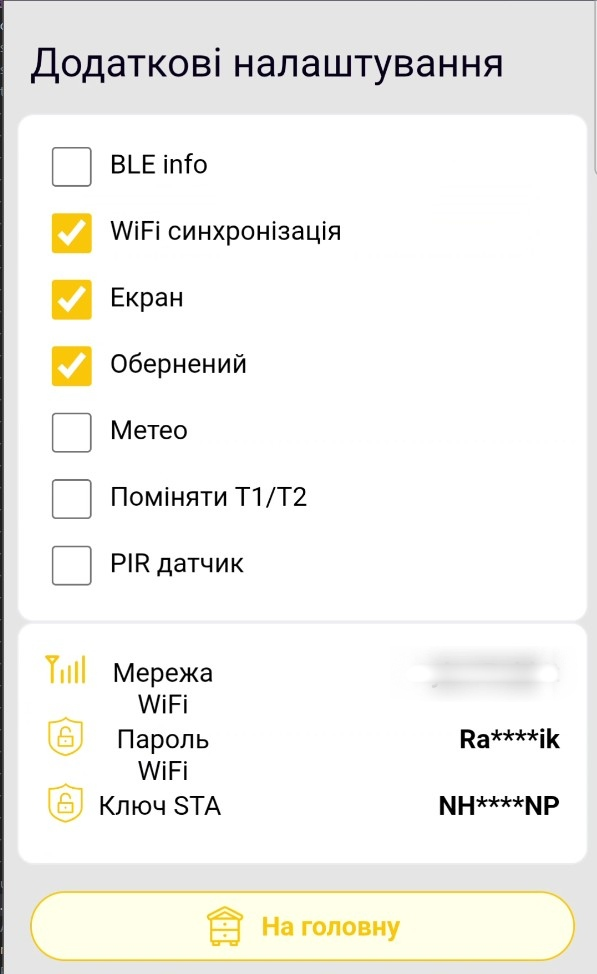

# Додаткові налаштування пристрою

Сторінка **Додаткові налаштування** належить вебінтерфейсу вимірювального пристрою BeeApiary. Вона вказує, яке додаткове обладнання встановлене, і керує окремими каналами передавання даних.

## Як відкрити

1. [Підключіться до точки доступу пристрою](../guides/configure-local-wifi.md).
2. Відкрийте `http://192.168.4.1`.
3. На головній сторінці виберіть **Додаткові налаштування**.
4. Прочитайте попередження вебінтерфейсу. Переходьте далі лише для свідомої перевірки або зміни параметрів.

!!! warning "Не змінюйте параметри навмання"
    Неправильне значення може порушити роботу пристрою. Апаратні прапорці вмикайте лише тоді, коли відповідне обладнання фізично встановлене. Не змінюйте мережеві параметри або ключі без потреби.

{ .doc-screenshot }

Значення мережі на screenshot наведені лише як приклад. На вашому пристрої вони відрізнятимуться.

## Перемикачі

| Елемент | Призначення | Зауваження |
|---|---|---|
| **BLE info** | Вмикає можливість локальної синхронізації даних через Bluetooth. | Після ввімкнення налаштуйте [синхронізацію через Bluetooth у застосунку](../guides/configure-bluetooth-sync.md). |
| **WiFi синхронізація** | Вмикає автоматичне передавання даних через зовнішню Wi-Fi мережу. | Зазвичай вмикається автоматично, коли застосунок передає пристрою підготовлені Wi-Fi- та хмарні налаштування. Не вмикайте вручну без коректних мережевих полів. |
| **Екран** | Повідомляє пристрою про фізично встановлений OLED-дисплей і активує роботу з ним. | Вмикайте лише за наявності дисплея. |
| **Обернений** | Повертає зображення OLED-дисплея на 180°. | Має значення лише за ввімкненого пункту **Екран**. |
| **Метео** | Активує встановлений метеодатчик тиску, вологості й додаткової температури. | Вмикайте лише за наявності датчика. |
| **Поміняти T1/T2** | Міняє місцями передані значення основних термометрів T1 і T2. | Зручно, якщо внутрішній і зовнішній датчики фізично поміняли місцями. Назви та налаштування каналів у застосунку залиште без змін. |
| **PIR датчик** | Активує тривожний вхід для PIR або іншого сумісного датчика пробудження системи. | Вмикайте лише за наявності підключеного датчика. |

## Мережеві поля

| Поле | Призначення | Зауваження |
|---|---|---|
| **Мережа WiFi** | Назва зовнішньої Wi-Fi мережі, до якої підключатиметься пристрій. | Повинна точно відповідати SSID мережі, доступної біля пристрою. |
| **Пароль WiFi** | Пароль зовнішньої Wi-Fi мережі. | Вебінтерфейс показує значення замаскованим. |
| **Ключ STA** | Службовий ключ передавання, отриманий під час реєстрації через застосунок. | Не редагуйте вручну. |

Wi-Fi-параметри безпечніше задавати через [налаштування синхронізації в застосунку](../guides/configure-wifi-sync.md). Застосунок формує потрібні дані та передає їх пристрою під час прямого підключення до `apiary_net`.
