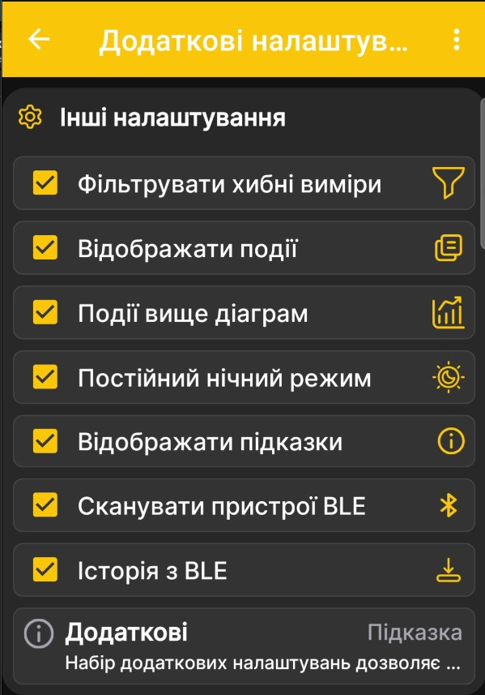
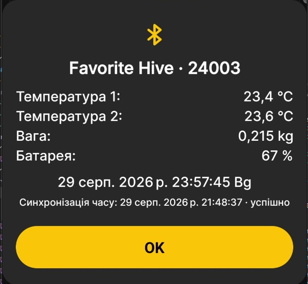

# Синхронізація даних через Bluetooth

Bluetooth дає застосунку BeeApiary змогу автоматично отримувати вимірювання, коли телефон перебуває поруч із пристроєм. SIM-картка, мобільний Інтернет і підключення до точки доступу `apiary_net` для цього не потрібні.

Після успішної синхронізації дані зберігаються на телефоні та відображаються на головній сторінці й графіках так само, як дані, отримані іншими каналами.

## Передумови

- на пристрої встановлено оновлення `08.2026` або новіше;
- у [додаткових налаштуваннях пристрою](additional-settings.md) увімкнено **BLE info**;
- час пристрою [синхронізовано](time-synchronization.md) із телефоном, а розбіжність не перевищує двох хвилин;
- Bluetooth на телефоні ввімкнено;
- застосунку надано дозволи для Bluetooth і дозволено працювати у фоні та прокидатися для запланованої синхронізації;
- телефон перебуває в зоні впевненого Bluetooth-зв'язку з пристроєм.

!!! warning "Розбіжність часу не більше двох хвилин"
    Пристрій і застосунок виходять на зв'язок у відповідний час. Якщо їхній час відрізняється більш ніж на дві хвилини, пристрій може розпочати передавання раніше або пізніше, ніж телефон почне сканування.

## Налаштування застосунку

На сторінці **Додаткові налаштування** застосунку використовуються два перемикачі:

| Перемикач | Призначення |
|---|---|
| **Сканувати пристрої BLE** | Дозволяє застосунку шукати доступні поблизу пристрої BeeApiary та отримувати від них вимірювання. |
| **Історія з BLE** | Дозволяє додатково забирати збережену на пристрої історію, зокрема дані за останню добу. Доступна глибина відновлення може становити від доби до тижня залежно від доступної історії та налаштування. |

{ .doc-screenshot }

## Як надходять дані

Пристрій формує новий набір вимірювань щогодини. У відповідний час застосунок шукає пристрій поблизу та приймає доступні дані. Для стабільної автоматичної роботи телефон має залишатися в зоні Bluetooth-зв'язку, а Android не повинен зупиняти фонову роботу застосунку.

Якщо телефон кілька годин був поза зоною зв'язку, пропущені набори можуть бути отримані під час наступної успішної синхронізації. Для цього має бути ввімкнено **Історія з BLE**, а потрібний проміжок повинен залишатися в доступній історії пристрою. Це дає змогу періодично наближатися до пристрою протягом кількох днів і пізніше відновлювати дані без пропусків у межах доступної глибини.

## Результат синхронізації

Під час роботи застосунку може з'явитися повідомлення з назвою вулика, отриманими вимірюваннями, часом запису та результатом синхронізації часу.

{ .doc-screenshot }

Останнє таке повідомлення можна повторно відкрити через пункт **BLE Info** у головному меню застосунку.

Практична процедура: [Налаштувати синхронізацію через Bluetooth](../guides/configure-bluetooth-sync.md).
