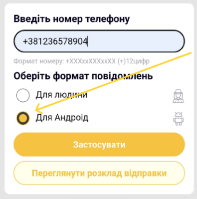
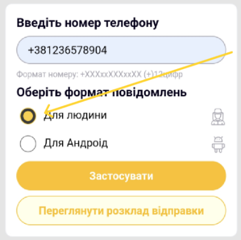
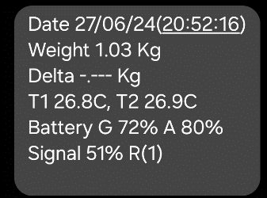
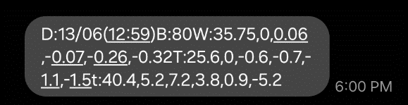
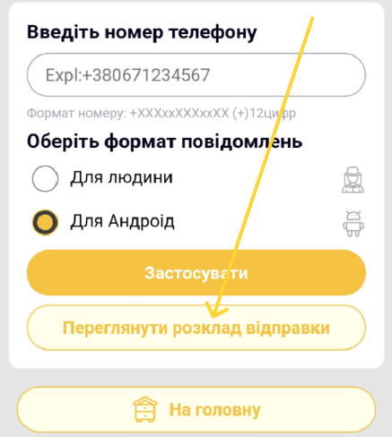
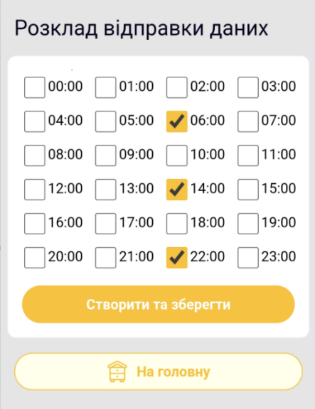
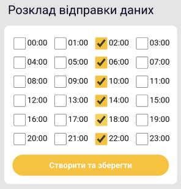

# GSM та SMS

Пристрій підтримує два номери одержувачів. Для кожного можна окремо вибрати формат:

- звичайний SMS, придатний для читання без застосунку BeeApiary;
- стислий SMS, який застосунок перетворює на набір вимірювань.

У вебінтерфейсі пристрою для стислого формату виберіть **Для Android**:

{ .doc-screenshot }

Для читання без застосунку виберіть **Для людини**:

{ .doc-screenshot }

У системному застосунку повідомлень Android звичайний SMS містить підписані поточні значення:

{ .doc-screenshot }

Стислий формат об'єднує дані для подальшої обробки застосунком:

{ .doc-screenshot }

Розклад спільний для обох номерів. У вибрані години пристрій вимірює, передає накопичені дані та переходить у режим сну. Не створюйте зайвих відправлень: це витрачає заряд і GSM-трафік.

Для стислого формату рекомендовано передавання приблизно кожні чотири години, щоб не переповнювати SMS і зберегти регулярний графік.

У вебінтерфейсі пристрою кнопка **Переглянути розклад відправки** доступна у формі номера:

{ .doc-screenshot }

У розкладі можна вибрати потрібні години:

{ .doc-screenshot }

Приклад ритму кожні чотири години:

{ .doc-screenshot }

Налаштування: [Налаштування GSM](../guides/configure-gsm.md). Проблеми: [Не надходять SMS](../troubleshooting/no-sms.md).
